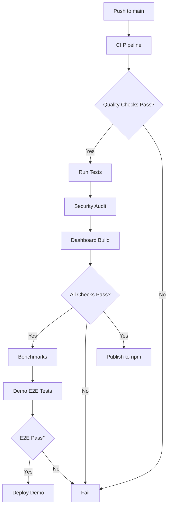

# CI/CD Pipeline Specification

This document specifies the continuous integration and deployment pipelines for imaginize using GitHub Actions.

## Overview

imaginize uses GitHub Actions for automated:
1. **Code Quality** - TypeScript, ESLint, Prettier checks
2. **Testing** - Multi-version Node.js testing with Bun
3. **Security** - Dependency auditing and vulnerability scanning
4. **Publishing** - Automated npm package publishing
5. **Benchmarks** - Performance regression detection
6. **E2E Testing** - Browser-based demo testing
7. **Deployment** - GitHub Pages demo deployment

**Total Workflows**: 5 GitHub Actions workflows

---

## Workflows

### 1. Main CI Pipeline (.github/workflows/ci.yml)

**Triggers**:
- Push to `main` branch
- Pull requests to `main` branch

**Jobs**:
1. Code Quality
2. Test (Node 18, 20, 22)
3. Security Audit
4. Dashboard Build
5. All Checks Summary

#### Job 1: Code Quality

**Purpose**: Validate code quality standards

**Steps**:
1. Checkout code
2. Setup Node.js 20
3. Install dependencies (`npm ci`)
4. TypeScript type checking (`npm run typecheck`)
5. ESLint linting (`npm run lint`)
6. Prettier format check (`npm run format:check`)
7. Build project (`npm run build`)

**Failure Conditions**:
- Any TypeScript compilation errors
- Any ESLint errors
- Prettier formatting issues
- Build failures

#### Job 2: Test (Matrix)

**Purpose**: Run test suite across multiple Node.js versions

**Matrix Strategy**:
- Node.js 18, 20, 22
- Fail-fast disabled (all versions tested)

**Steps**:
1. Checkout code
2. Setup Node.js (matrix version)
3. Install dependencies (`npm ci`)
4. Setup Bun (for test runner)
5. Run tests (`npm test`)
6. Test summary

**Failure Handling**:
- `continue-on-error: true` (some tests require API keys)
- Test failures logged but don't block CI

#### Job 3: Security Audit

**Purpose**: Check for security vulnerabilities

**Steps**:
1. Checkout code
2. Setup Node.js 20
3. Install dependencies (`npm ci`)
4. Run npm audit (`npm audit --audit-level=moderate`)
5. Check outdated dependencies (`npm outdated`)

**Severity Levels**:
- **Critical**: Build fails
- **High**: Build fails
- **Moderate**: Warning (logged)
- **Low**: Informational

#### Job 4: Dashboard Build

**Purpose**: Validate dashboard build process

**Steps**:
1. Checkout code
2. Setup Node.js 20
3. Install main dependencies (`npm ci`)
4. Install dashboard dependencies (`cd dashboard && npm ci`)
5. Build dashboard (`npm run build`)
6. Check bundle size

**Failure Conditions**:
- Dashboard build failures
- Bundle size exceeds limits

#### Job 5: All Checks Summary

**Purpose**: Aggregate all job results

**Dependencies**: Requires quality, test, security, dashboard

**Logic**:
- ✅ Quality checks must pass (hard failure)
- ⚠️ Test failures logged (soft failure - API keys)
- ⚠️ Security warnings logged (soft failure - may not be actionable)
- ✅ Dashboard build must pass (hard failure)

---

### 2. npm Publishing (.github/workflows/publish.yml)

**Triggers**:
- Push to `main` branch (after successful CI)
- Manual workflow dispatch

**Purpose**: Automatically publish package to npm

**Jobs**:
1. Publish to npm

**Steps**:
1. Checkout code
2. Setup Node.js 20 with npm registry
3. Install dependencies (`npm ci`)
4. Run full test suite (`npm test`)
5. Build project (`npm run build`)
6. Bump version (patch)
7. Publish to npm (`npm publish`)
8. Create git tag
9. Push tag to repository

**Secrets Required**:
- `NPM_TOKEN` - npm authentication token

**Version Strategy**:
- Automatic patch version bump
- Git tag created for each release
- Changelog generated from commits

**Failure Conditions**:
- Test failures
- Build failures
- npm publish errors

---

### 3. Performance Benchmarks (.github/workflows/benchmarks.yml)

**Triggers**:
- Push to `main` branch
- Pull requests to `main` branch
- Manual workflow dispatch

**Purpose**: Run performance benchmarks and detect regressions

**Jobs**:
1. Run Benchmarks

**Steps**:
1. Checkout code
2. Setup Node.js 20
3. Install dependencies (`npm ci`)
4. Run benchmarks (`npm run bench`)
5. Compare with baseline
6. Post PR comment with results
7. Upload benchmark results as artifacts

**Baseline Comparison**:
- Compare against `benchmarks/baselines/v2.7.0.json`
- 5% threshold for regression detection
- Report improvements and regressions

**PR Comment Format**:
```markdown
## Benchmark Results

### Performance Summary

| Benchmark | Current | Baseline | Change | Status |
|-----------|---------|----------|--------|--------|
| State file write | 650μs | 640μs | +1.6% | ⚪ No change |
| EPUB parsing | 5.79ms | 5.65ms | +2.5% | ⚪ No change |
| Token estimation (long) | 719μs | 650μs | +10.6% | 🔴 Regression |

### Regressions Detected

- Token estimation (long text): 10.6% slower (minor)

### How to Interpret

- 🟢 Improvement: >5% faster
- 🔴 Regression: >5% slower
- ⚪ No change: Within 5% variance
```

**Artifacts**:
- Benchmark results JSON
- Benchmark report Markdown
- 30-day retention

**Failure Conditions**:
- Severe regressions (>50% slower)

---

### 4. Demo E2E Tests (.github/workflows/demo-e2e.yml)

**Triggers**:
- Push to `main` branch
- Pull requests to `main` branch
- Manual workflow dispatch

**Purpose**: Run end-to-end tests for GitHub Pages demo

**Jobs**:
1. E2E Tests

**Steps**:
1. Checkout code
2. Setup Node.js 20
3. Install demo dependencies (`cd demo && npm ci`)
4. Install Playwright browsers
5. Run E2E tests (`npx playwright test`)
6. Upload test results
7. Upload screenshots/videos (on failure)

**Browser Matrix**:
- Chrome (latest)
- Firefox (latest)
- Safari (WebKit)
- iPhone 12 (Mobile Safari)
- Pixel 5 (Mobile Chrome)

**Test Categories**:
- Initial page load
- File upload (EPUB/PDF)
- API key management
- Processing flow
- Results view
- Error scenarios
- Mobile responsive
- Accessibility (WCAG 2.1 AA)

**Artifacts**:
- Test results HTML
- Screenshots (on failure)
- Videos (on failure)
- 30-day retention

**Failure Conditions**:
- Any E2E test failures
- Accessibility violations

---

### 5. GitHub Pages Deployment (.github/workflows/deploy-demo.yml)

**Triggers**:
- Push to `main` branch (after successful CI + E2E)
- Manual workflow dispatch

**Purpose**: Deploy GitHub Pages demo

**Jobs**:
1. Pre-deployment E2E Tests
2. Build and Deploy

**Job 1: Pre-deployment E2E**:
- Run full E2E test suite
- Ensure all tests pass before deployment
- Block deployment on failure

**Job 2: Build and Deploy**:
1. Checkout code
2. Setup Node.js 20
3. Install demo dependencies
4. Build demo (`cd demo && npm run build`)
5. Deploy to GitHub Pages

**Deployment Target**:
- https://tribixbite.github.io/imaginize/

**Base Path Handling**:
- Base path set to `/imaginize/` for GitHub Pages
- Assets correctly referenced

**Failure Conditions**:
- Pre-deployment E2E failures
- Build failures
- Deployment errors

---

## Workflow Dependencies



---

## Environment Variables

### Required Secrets

| Secret | Purpose | Used In |
|--------|---------|---------|
| `NPM_TOKEN` | npm package publishing | publish.yml |
| `GITHUB_TOKEN` | GitHub API access (automatic) | All workflows |

### Optional Environment Variables

| Variable | Purpose | Default |
|----------|---------|---------|
| `BENCHMARK_HISTORY` | Enable benchmark history tracking | 0 (disabled) |
| `NODE_ENV` | Node environment | production |
| `CI` | CI environment flag | true |

---

## Caching Strategy

### npm Dependencies

All workflows use npm caching:
```yaml
- uses: actions/setup-node@v4
  with:
    node-version: '20'
    cache: 'npm'
```

**Benefits**:
- Faster dependency installation
- Reduced bandwidth usage
- Consistent dependency versions

### Playwright Browsers

E2E workflow caches Playwright browsers:
```yaml
- uses: actions/cache@v3
  with:
    path: ~/.cache/ms-playwright
    key: playwright-${{ runner.os }}-${{ hashFiles('demo/package-lock.json') }}
```

---

## Artifact Retention

| Artifact | Retention | Purpose |
|----------|-----------|---------|
| Benchmark results | 30 days | Performance trend analysis |
| E2E test results | 30 days | Debugging test failures |
| E2E screenshots | 30 days | Visual debugging |
| E2E videos | 30 days | Test replay |

---

## Performance Metrics

### Average Workflow Times

| Workflow | Duration | Frequency |
|----------|----------|-----------|
| CI Pipeline | ~5 minutes | Every push/PR |
| npm Publishing | ~6 minutes | After successful CI |
| Benchmarks | ~3 minutes | Every push/PR |
| Demo E2E Tests | ~8 minutes | Every push/PR |
| GitHub Pages Deploy | ~4 minutes | After successful E2E |

**Total CI Time**: ~26 minutes (per push to main)

### Optimization Strategies

1. **Parallel Jobs**: Run quality, test, security, dashboard in parallel
2. **Dependency Caching**: Cache npm dependencies and Playwright browsers
3. **Fail-Fast Disabled**: Run all matrix versions for complete testing
4. **Selective Triggering**: Only run relevant workflows for specific changes

---

## Monitoring and Alerts

### Failure Notifications

**GitHub Notifications**:
- Email on workflow failure
- GitHub UI status badges
- PR status checks

**Status Badges**:
```markdown


```

### Manual Workflow Dispatch

All workflows support manual triggering:
```bash
gh workflow run ci.yml
gh workflow run publish.yml
gh workflow run benchmarks.yml
gh workflow run demo-e2e.yml
gh workflow run deploy-demo.yml
```

---

## Best Practices

### Pull Request Workflow

1. **Create PR**: Open pull request to `main`
2. **CI Runs**: Automatic CI pipeline execution
3. **Review Required**: At least one approval
4. **E2E Tests**: Automatic E2E test execution
5. **Benchmarks**: Performance regression check
6. **Merge**: Squash and merge to `main`
7. **Auto-Publish**: Automatic npm publish
8. **Auto-Deploy**: Automatic demo deployment

### Commit Message Standards

Follow Conventional Commits for automatic changelog generation:
- `feat:` - New features
- `fix:` - Bug fixes
- `docs:` - Documentation changes
- `test:` - Test additions/modifications
- `chore:` - Maintenance tasks
- `refactor:` - Code refactoring

### Version Bumping

Automatic version bumping based on commit type:
- `feat:` - Minor version bump
- `fix:` - Patch version bump
- `BREAKING CHANGE:` - Major version bump

---

## Troubleshooting

### Common Issues

**Issue**: Tests failing due to missing API keys

**Solution**: Expected behavior. Tests pass locally with API keys. CI marks as soft failure.

**Issue**: Benchmark regressions

**Solution**:
1. Review benchmark trend report
2. Investigate performance changes
3. Update baseline if intentional
4. Fix performance issues if unintentional

**Issue**: E2E tests flaky

**Solution**:
1. Check screenshots/videos in artifacts
2. Retry failed tests locally
3. Add wait conditions for async operations
4. Increase timeout values if needed

**Issue**: npm publish fails

**Solution**:
1. Check `NPM_TOKEN` secret is valid
2. Verify version bump occurred
3. Check npm registry status
4. Retry workflow manually

---

## Future Enhancements

1. **Code Coverage Reporting** - Add coverage reports to CI
2. **Performance Budgets** - Fail on bundle size increases
3. **Automated Dependency Updates** - Dependabot integration
4. **Canary Releases** - Pre-release versions for testing
5. **Multi-Environment Deployment** - Staging environment before production

---

## Related Documentation

- [Test Suite](./test-suite.md) - Testing standards
- [Code Quality](./code-quality.md) - Quality checks
- [npm Publishing](./npm-publishing.md) - Publishing process

---

**Status**: Complete ✅
**Last Updated**: 2025-11-14
**Version**: 2.7.0+
**Workflows**: 5 GitHub Actions workflows
**Total CI Time**: ~26 minutes per push to main
