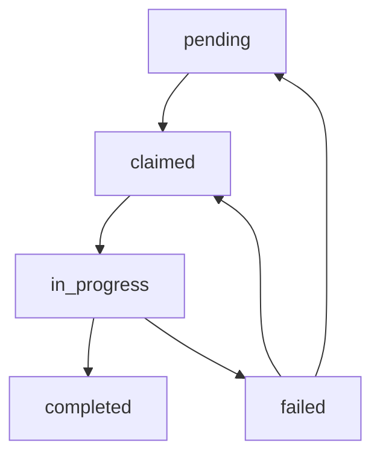

# Manifest Format Specification

Concurrent processing coordination schema and file format in imaginize.

## Overview

The manifest file (`.imaginize.manifest.json`) coordinates work across multiple processes in concurrent mode:
- **Chapter Claiming** - Processes claim chapters atomically
- **Progress Tracking** - Track which chapters are in_progress/completed/failed
- **Process Coordination** - Avoid duplicate work
- **State Recovery** - Resume after crashes

---

## File Location

**Path**: `.imaginize.manifest.json`

**Created**: Automatically when `--concurrent` flag is used

**Lifecycle**:
- Created at start of concurrent processing
- Updated atomically after each chapter state change
- Deleted on successful completion
- Retained on failure for recovery

---

## Schema

### ManifestFile Interface

```typescript
interface ManifestFile {
  version: string;              // Manifest version (e.g., "2.0.0")
  bookFile: string;             // Path to book file
  bookTitle: string;            // Book title
  totalChapters: number;        // Total number of chapters
  createdAt: string;            // ISO 8601 timestamp
  lastUpdated: string;          // ISO 8601 timestamp
  chapters: Record<string, ChapterManifest>;  // Chapter states
}
```

### ChapterManifest Interface

```typescript
interface ChapterManifest {
  status: 'pending' | 'claimed' | 'in_progress' | 'completed' | 'failed';
  claimedBy?: string;           // Process ID that claimed the chapter
  claimedAt?: string;           // ISO 8601 timestamp
  completedAt?: string;         // ISO 8601 timestamp (if completed)
  failedAt?: string;            // ISO 8601 timestamp (if failed)
  error?: string;               // Error message (if failed)
  tokensUsed?: number;          // Tokens consumed for this chapter
  retryCount?: number;          // Number of retry attempts
}
```

---

## Example Manifest

### Initial State

**After Manifest Creation**:
```json
{
  "version": "2.0.0",
  "bookFile": "/path/to/the-hobbit.epub",
  "bookTitle": "The Hobbit",
  "totalChapters": 19,
  "createdAt": "2025-11-14T10:00:00.000Z",
  "lastUpdated": "2025-11-14T10:00:00.000Z",
  "chapters": {
    "1": { "status": "pending" },
    "2": { "status": "pending" },
    "3": { "status": "pending" },
    "4": { "status": "pending" },
    "5": { "status": "pending" },
    "6": { "status": "pending" },
    "7": { "status": "pending" },
    "8": { "status": "pending" },
    "9": { "status": "pending" },
    "10": { "status": "pending" },
    "11": { "status": "pending" },
    "12": { "status": "pending" },
    "13": { "status": "pending" },
    "14": { "status": "pending" },
    "15": { "status": "pending" },
    "16": { "status": "pending" },
    "17": { "status": "pending" },
    "18": { "status": "pending" },
    "19": { "status": "pending" }
  }
}
```

### During Processing

**3 Processes Active** (batch size 3):
```json
{
  "version": "2.0.0",
  "bookFile": "/path/to/the-hobbit.epub",
  "bookTitle": "The Hobbit",
  "totalChapters": 19,
  "createdAt": "2025-11-14T10:00:00.000Z",
  "lastUpdated": "2025-11-14T10:05:30.000Z",
  "chapters": {
    "1": {
      "status": "completed",
      "claimedBy": "process-12345",
      "claimedAt": "2025-11-14T10:00:05.000Z",
      "completedAt": "2025-11-14T10:02:15.000Z",
      "tokensUsed": 8234
    },
    "2": {
      "status": "completed",
      "claimedBy": "process-12346",
      "claimedAt": "2025-11-14T10:00:05.000Z",
      "completedAt": "2025-11-14T10:02:45.000Z",
      "tokensUsed": 7892
    },
    "3": {
      "status": "in_progress",
      "claimedBy": "process-12347",
      "claimedAt": "2025-11-14T10:00:05.000Z"
    },
    "4": {
      "status": "claimed",
      "claimedBy": "process-12345",
      "claimedAt": "2025-11-14T10:02:20.000Z"
    },
    "5": {
      "status": "claimed",
      "claimedBy": "process-12346",
      "claimedAt": "2025-11-14T10:02:50.000Z"
    },
    "6": { "status": "pending" },
    "7": { "status": "pending" },
    "8": { "status": "pending" },
    "9": { "status": "pending" },
    "10": { "status": "pending" },
    "11": { "status": "pending" },
    "12": { "status": "pending" },
    "13": { "status": "pending" },
    "14": { "status": "pending" },
    "15": { "status": "pending" },
    "16": { "status": "pending" },
    "17": { "status": "pending" },
    "18": { "status": "pending" },
    "19": { "status": "pending" }
  }
}
```

### With Failures

**Chapter 3 Failed** (will be retried):
```json
{
  "chapters": {
    "1": {
      "status": "completed",
      "claimedBy": "process-12345",
      "claimedAt": "2025-11-14T10:00:05.000Z",
      "completedAt": "2025-11-14T10:02:15.000Z",
      "tokensUsed": 8234
    },
    "2": {
      "status": "completed",
      "claimedBy": "process-12346",
      "claimedAt": "2025-11-14T10:00:05.000Z",
      "completedAt": "2025-11-14T10:02:45.000Z",
      "tokensUsed": 7892
    },
    "3": {
      "status": "failed",
      "claimedBy": "process-12347",
      "claimedAt": "2025-11-14T10:00:05.000Z",
      "failedAt": "2025-11-14T10:03:00.000Z",
      "error": "Rate limit exceeded. Retry after 60 seconds.",
      "retryCount": 1
    },
    "4": { "status": "pending" },
    ...
  }
}
```

---

## Status States

### State Transitions



**State Descriptions**:

1. **pending**: Chapter not yet claimed by any process
2. **claimed**: Chapter claimed but processing not started
3. **in_progress**: Chapter actively being processed
4. **completed**: Chapter successfully processed
5. **failed**: Chapter processing failed (can be retried)

### Claim Algorithm

**Process Attempts to Claim**:
```typescript
async function claimChapter(chapterNumber: number): Promise<boolean> {
  const lockPath = '.imaginize.manifest.lock';
  
  // Acquire lock
  await acquireLock(lockPath);
  
  try {
    // Read manifest
    const manifest = await readManifest();
    
    // Check if chapter is claimable
    const chapter = manifest.chapters[chapterNumber];
    if (chapter.status !== 'pending' && chapter.status !== 'failed') {
      return false; // Already claimed/completed
    }
    
    // Claim chapter
    chapter.status = 'claimed';
    chapter.claimedBy = process.pid.toString();
    chapter.claimedAt = new Date().toISOString();
    
    // Update manifest atomically
    await writeManifest(manifest);
    
    return true;
  } finally {
    // Release lock
    await releaseLock(lockPath);
  }
}
```

---

## Atomic Operations

### File Locking

**Lock File**: `.imaginize.manifest.lock`

**Lock Acquisition**:
```typescript
async function acquireLock(lockPath: string, timeout: number = 30000): Promise<void> {
  const startTime = Date.now();
  
  while (Date.now() - startTime < timeout) {
    try {
      // Exclusive write flag: fails if file exists
      await writeFile(lockPath, process.pid.toString(), { flag: 'wx' });
      return; // Lock acquired
    } catch (error) {
      // Lock exists, check if stale
      if (await isLockStale(lockPath)) {
        await unlinkFile(lockPath); // Remove stale lock
        continue;
      }
      
      // Wait and retry
      await sleep(100);
    }
  }
  
  throw new Error('Failed to acquire lock: timeout');
}
```

**Stale Lock Detection**:
```typescript
async function isLockStale(lockPath: string): Promise<boolean> {
  try {
    const stats = await statFile(lockPath);
    const age = Date.now() - stats.mtimeMs;
    
    // Locks older than 10 minutes are stale
    return age > 600000;
  } catch {
    return false;
  }
}
```

### Atomic Write

**Write-Rename Pattern**:
```typescript
async function writeManifest(manifest: ManifestFile): Promise<void> {
  const manifestPath = '.imaginize.manifest.json';
  const tempPath = `${manifestPath}.tmp`;
  
  // Update timestamp
  manifest.lastUpdated = new Date().toISOString();
  
  // Write to temp file
  await writeFile(tempPath, JSON.stringify(manifest, null, 2));
  
  // Atomic rename
  await rename(tempPath, manifestPath);
}
```

---

## Coordination Patterns

### Worker Pool

**Main Process**:
```typescript
async function spawnWorkers(concurrency: number): Promise<void> {
  const workers: ChildProcess[] = [];
  
  // Spawn worker processes
  for (let i = 0; i < concurrency; i++) {
    const worker = spawn('node', ['dist/worker.js']);
    workers.push(worker);
  }
  
  // Wait for all workers to complete
  await Promise.all(workers.map(w => waitForExit(w)));
}
```

**Worker Process**:
```typescript
async function workerMain(): Promise<void> {
  while (true) {
    // Find next available chapter
    const chapterNumber = await findNextChapter();
    if (!chapterNumber) break; // No more work
    
    // Claim chapter
    const claimed = await claimChapter(chapterNumber);
    if (!claimed) continue; // Already claimed
    
    // Process chapter
    try {
      await processChapter(chapterNumber);
      await markChapterCompleted(chapterNumber);
    } catch (error) {
      await markChapterFailed(chapterNumber, error);
    }
  }
}
```

### Progress Monitoring

**Check Overall Progress**:
```typescript
async function getProgress(): Promise<ProgressInfo> {
  const manifest = await readManifest();
  
  const total = manifest.totalChapters;
  const completed = Object.values(manifest.chapters).filter(c => c.status === 'completed').length;
  const inProgress = Object.values(manifest.chapters).filter(c => c.status === 'in_progress').length;
  const failed = Object.values(manifest.chapters).filter(c => c.status === 'failed').length;
  const pending = total - completed - inProgress - failed;
  
  return {
    total,
    completed,
    inProgress,
    failed,
    pending,
    percentComplete: (completed / total) * 100
  };
}
```

---

## Error Recovery

### Stuck Chapter Detection

**Timeout Check**:
```typescript
async function detectStuckChapters(): Promise<number[]> {
  const manifest = await readManifest();
  const stuckChapters: number[] = [];
  
  const now = Date.now();
  const stuckThreshold = 300000; // 5 minutes
  
  for (const [chapterNum, chapter] of Object.entries(manifest.chapters)) {
    if (chapter.status === 'in_progress' && chapter.claimedAt) {
      const claimedTime = new Date(chapter.claimedAt).getTime();
      const age = now - claimedTime;
      
      if (age > stuckThreshold) {
        stuckChapters.push(parseInt(chapterNum));
      }
    }
  }
  
  return stuckChapters;
}
```

**Auto-Recovery**:
```typescript
async function recoverStuckChapters(): Promise<void> {
  const stuckChapters = await detectStuckChapters();
  
  for (const chapterNum of stuckChapters) {
    console.warn(`⚠️  Chapter ${chapterNum} stuck for >5 minutes. Resetting...`);
    await resetChapter(chapterNum);
  }
}
```

### Process Crash Recovery

**Detect Dead Processes**:
```typescript
async function cleanupDeadProcesses(): Promise<void> {
  const manifest = await readManifest();
  
  for (const [chapterNum, chapter] of Object.entries(manifest.chapters)) {
    if (chapter.claimedBy && !isProcessAlive(chapter.claimedBy)) {
      console.warn(`⚠️  Process ${chapter.claimedBy} dead. Resetting chapter ${chapterNum}...`);
      await resetChapter(parseInt(chapterNum));
    }
  }
}

function isProcessAlive(pid: string): boolean {
  try {
    // Send signal 0 to check if process exists
    process.kill(parseInt(pid), 0);
    return true;
  } catch {
    return false;
  }
}
```

---

## Usage Examples

### Initialize Manifest

**Create Manifest**:
```typescript
import { createManifest } from './lib/manifest-manager.js';

const manifest = await createManifest({
  bookFile: '/path/to/book.epub',
  bookTitle: 'The Hobbit',
  totalChapters: 19
});
```

### Claim and Process Chapter

**Worker Flow**:
```typescript
import { claimChapter, markCompleted, markFailed } from './lib/manifest-manager.js';

const chapterNumber = 3;

// Attempt to claim
const claimed = await claimChapter(chapterNumber);
if (!claimed) {
  console.log('Chapter already claimed');
  return;
}

// Process chapter
try {
  const result = await processChapter(chapterNumber);
  await markCompleted(chapterNumber, result.tokensUsed);
} catch (error) {
  await markFailed(chapterNumber, error.message);
}
```

### Monitor Progress

**Progress Dashboard**:
```typescript
import { getProgress } from './lib/manifest-manager.js';

setInterval(async () => {
  const progress = await getProgress();
  console.log(`Progress: ${progress.completed}/${progress.total} (${progress.percentComplete.toFixed(1)}%)`);
  console.log(`  In Progress: ${progress.inProgress}`);
  console.log(`  Failed: ${progress.failed}`);
  console.log(`  Pending: ${progress.pending}`);
}, 5000); // Update every 5 seconds
```

---

## Related Documentation

- [Parallel Processing](./parallel-processing.md) - Concurrent execution
- [State Management](./state-management.md) - State file format
- [Error Recovery](./error-recovery.md) - Failure handling

---

**Status**: Complete ✅
**Last Updated**: 2025-11-14
**Lock Timeout**: 30 seconds
**Stuck Threshold**: 5 minutes
